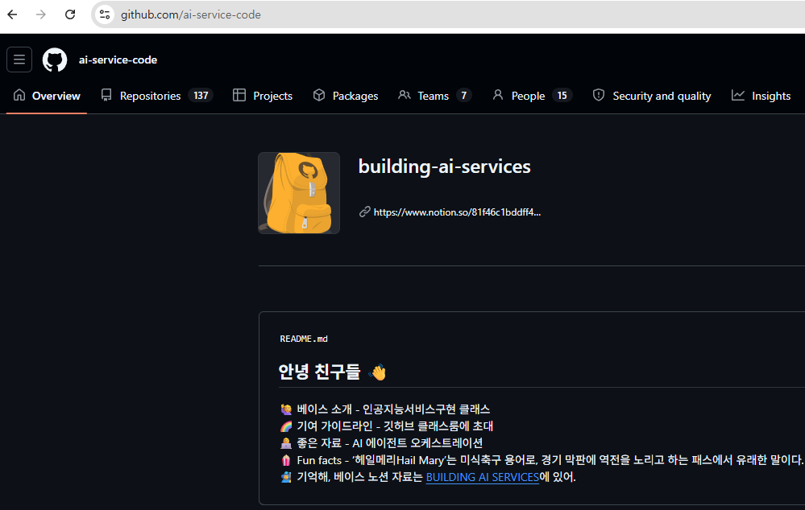

# Machine Learning 머신러닝

- [x] ml_01_머신러닝개요
- [x] ml_02_지도학습_KNN
- [x] ml_03_지도학습_LinearRegression
- [x] ml_04_지도학습_Ridge_Lasso_Regression

  
`git clone 학생저장소`  
이 소스코드는 Python 3 버전을 기준으로 작성되었으며 >= 3.10.0, 현재 라이브러리 호환성이 Python 3.10.10을 사용하는 것이 좋습니다. 하지만 대부분의 코드 예제는 3.10 ~ 3.12 버전을 호환될 수 있습니다.
#### PIP
`pip install -r requrements.txt`

PyCharm에 Jupyter Notebook 통합 기능이 제공되므로 노트북 소스 코드를 편집, 실행 및 디버깅할 수 있을 뿐 아니라 스트림 데이터, 이미지 및 기타 미디어를 포함한 실행 출력을 검토할 수 있습니다.  
#### ml_01_머신러닝개요
https://app.notion.com/p/35d0711f396d80bbb369f4d24a74ff8d?v=0ce5aee757bd4aebad59bc9a5c6d2ad0&source=copy_link  
[[open ml-01](ml_01_머신러닝개요.ipynb)]
#### ml_02_지도학습_KNN
https://app.notion.com/p/KNN-36b0711f396d8088b751c7e82b307dd5?v=0ce5aee757bd4aebad59bc9a5c6d2ad0&source=copy_link  
[[open ml-02](ml_02_지도학습_KNN.ipynb)]
#### ml_03_지도학습_LinearRegression
https://app.notion.com/p/LinearRegression-3720711f396d80639dc0fe1c7dfc91e7?v=0ce5aee757bd4aebad59bc9a5c6d2ad0&source=copy_link  
[[open ml-03](ml_03_지도학습_LinearRegression.ipynb)]
#### ml_04_지도학습_Ridge_Lasso_Regression
https://app.notion.com/p/Ridge_Lasso_Regression-4-3790711f396d80fc9043cd369922f4d1?v=0ce5aee757bd4aebad59bc9a5c6d2ad0&source=copy_link  
[[open ml-04](ml_04_지도학습_Ridge_Lasso_Regression.ipynb)]

